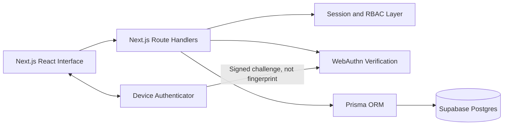

# Project Defence Guide

## Project title

**Securing and Personalising Collaborative E-Learning with Fingerprint Biometrics**

## One-minute project summary

SecureLearn is a full-stack collaborative e-learning platform for students, lecturers and administrators. Students can enrol in courses, access materials, discuss lessons, submit assignments and receive personalised recommendations. Lecturers can create courses, add materials and assignments, moderate discussions and grade submissions. Administrators manage users, courses and security logs.

The principal security contribution is the use of WebAuthn passkeys for fingerprint-backed authentication. The user's device performs the fingerprint or screen-lock verification locally. The application receives a cryptographic signature and stores only a credential public key, credential ID, counter and related metadata. It never stores fingerprint images or templates.

## Problem addressed

Conventional e-learning systems commonly depend on passwords alone. Passwords may be guessed, reused, shared or stolen through phishing. At the same time, e-learning platforms need personalisation and collaboration, which increase the amount of sensitive activity associated with each account. SecureLearn demonstrates how stronger authentication, role-based authorisation, audit logging and transparent personalisation can be combined in one understandable prototype.

## System architecture

## Biometric authentication sequence

1. An authenticated user requests passkey enrolment.
2. The server creates a unique challenge and stores it with a five-minute expiry.
3. The browser invokes the device authenticator.
4. The device checks the user's fingerprint, face, PIN or screen lock locally.
5. The authenticator creates a private/public key pair.
6. The private key remains protected by the device.
7. The server verifies the signed registration response.
8. The server stores only the public credential information.
9. During login, a new challenge is signed by the device and verified with the stored public key.
10. A random HTTP-only session is created after successful verification.

## Why this is safer than storing fingerprints

A stolen fingerprint database cannot be reset in the same way as a password. Raw biometric storage also creates privacy, consent and breach risks. In SecureLearn, the biometric is outside the application security boundary. A database breach exposes public keys rather than fingerprints or private authentication keys.

## Role-based access control

### Student

- Browse and enrol in published courses
- Access protected content only after enrolment
- Post and reply in course discussions
- Submit each assignment once, with later updates permitted
- View grades and lecturer feedback
- Receive recommendations and notifications

### Lecturer

- Create and manage only personally owned courses
- Add materials and assignments
- View enrolled students
- Moderate course discussions
- Review and grade only submissions belonging to personally owned courses

### Administrator

- View platform totals
- Enable or disable user accounts
- Remove courses
- Inspect authentication and action logs
- Cannot be created through public registration

## Personalisation approach

The prototype uses explainable rule-based recommendations rather than an opaque machine-learning model:

- With fewer than two enrolments, beginner courses are prioritised.
- With sufficient enrolment history, course categories are used as interests.
- Already enrolled courses are excluded.
- Recent published courses fill unused recommendation slots.
- The latest course-view event powers “Continue learning”.
- Pending assignments are filtered by enrolment, submission status and due date.

This is appropriate for a final-year prototype because it can be tested with a small dataset and clearly explained to evaluators.

## Important database relationships

- One user can own many courses as a lecturer.
- Students and courses have a many-to-many relationship through Enrollment.
- A course has many materials, assignments and discussion posts.
- An assignment has many submissions, but one student can have only one submission per assignment.
- Discussion posts use a self-referencing parent relationship for replies.
- A user can have multiple WebAuthn credentials for multiple devices.
- Sessions store hashes of random tokens rather than raw session tokens.
- Security logs may reference a user but retain records when appropriate.

## Security controls to demonstrate

- Passwords are bcrypt-hashed with 12 rounds.
- Session tokens contain 256 bits of randomness.
- Only session-token hashes are stored in Supabase Postgres.
- Cookies are HTTP-only, SameSite=Lax and Secure in production.
- WebAuthn challenges expire after five minutes.
- WebAuthn requires user verification.
- Five failed password attempts from one IP trigger a fifteen-minute block.
- Middleware provides an initial protected-route check.
- Every protected page and API repeats server-side authentication and role checks.
- Course ownership and student enrolment are validated at the data layer.
- Major security-sensitive actions create audit records.

## Recommended live demonstration

1. Open the homepage and explain the privacy-first biometric statement.
2. Register a student account.
3. Log in with the password and enrol a passkey.
4. Open Prisma Studio and show that no fingerprint field exists.
5. Log out and log in with the passkey.
6. Browse and enrol in a course.
7. Open protected materials and create a discussion reply.
8. Submit an assignment.
9. Log in as the lecturer and grade the submission.
10. Log in as the administrator and inspect the submission log, login log and user-management page.
11. Disable a demonstration user and show that existing sessions are removed.

## Likely defence questions

### Is this truly fingerprint authentication?

It is fingerprint-backed authentication when the device uses a fingerprint sensor, but the web standard is WebAuthn/passkeys. The device may alternatively use face recognition, a PIN or screen lock. The application intentionally cannot see which biometric was used or obtain the biometric sample.

### Why not store fingerprint templates?

A web application should not become a biometric-data custodian when platform authenticators can provide cryptographic proof. Public-key credentials reduce privacy exposure and are more realistic for deployment.

### What prevents a lecturer from editing another lecturer's course?

Every lecturer mutation queries the database using both the course ID and the authenticated lecturer ID. Client-side navigation is not trusted.

### What prevents a student from opening a course URL without enrolment?

Protected course data is returned only after a server-side Enrollment check. Knowing the URL is insufficient.

### How is personalisation evaluated?

Create students with different enrolment histories and confirm that recommendations prioritise beginner courses for new students and related categories for students with at least two enrolments.

### What happens if the database is breached?

Password hashes, public WebAuthn keys and hashed session tokens may be exposed, but raw passwords, session tokens, private passkey keys and biometric data are not stored. Incident response and credential rotation would still be required.

### What are the main limitations?

The prototype uses external file links rather than managed uploads, database-based single-instance rate limiting rather than Redis, no email verification or password reset, and rule-based recommendations rather than a trained model.
